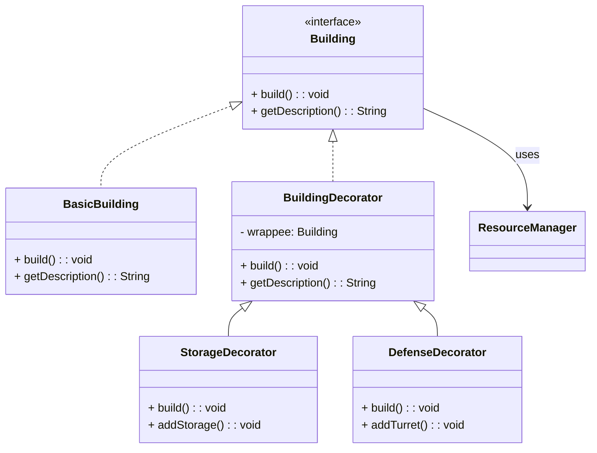

```mermaid
classDiagram
    %% Building and Decorators
    class Building {
      <<interface>>
      + build(): void
      + getDescription(): String
    }
    
    class BasicBuilding {
      + build(): void
      + getDescription(): String
    }
    
    class BuildingDecorator {
      - wrappee: Building
      + build(): void
      + getDescription(): String
    }
    
    class StorageDecorator {
      + build(): void
      + addStorage(): void
    }
    
    class DefenseDecorator {
      + build(): void
      + addTurret(): void
    }
    
    %% Relationships
    Building <|.. BasicBuilding
    Building <|.. BuildingDecorator
    BuildingDecorator <|-- StorageDecorator
    BuildingDecorator <|-- DefenseDecorator
    Building --> ResourceManager : uses
```
