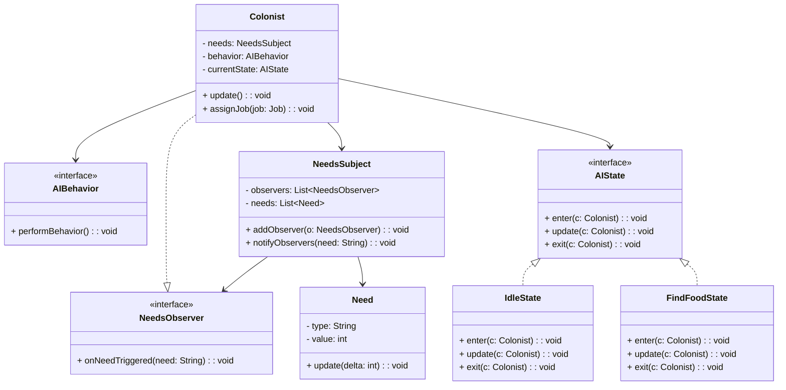

```mermaid
classDiagram
    %% Colonist and AI States
    class Colonist {
      - needs: NeedsSubject
      - behavior: AIBehavior
      - currentState: AIState
      + update(): void
      + assignJob(job: Job): void
    }
    
    class AIBehavior {
      <<interface>>
      + performBehavior(): void
    }
    
    class AIState {
      <<interface>>
      + enter(c: Colonist): void
      + update(c: Colonist): void
      + exit(c: Colonist): void
    }
    
    class IdleState {
      + enter(c: Colonist): void
      + update(c: Colonist): void
      + exit(c: Colonist): void
    }
    
    class FindFoodState {
      + enter(c: Colonist): void
      + update(c: Colonist): void
      + exit(c: Colonist): void
    }
    
    %% Needs System
    class NeedsSubject {
      - observers: List~NeedsObserver~
      - needs: List~Need~
      + addObserver(o: NeedsObserver): void
      + notifyObservers(need: String): void
    }
    
    class NeedsObserver {
      <<interface>>
      + onNeedTriggered(need: String): void
    }
    
    class Need {
      - type: String
      - value: int
      + update(delta: int): void
    }
    
    %% Relationships
    Colonist --> NeedsSubject
    Colonist --> AIBehavior
    Colonist --> AIState
    Colonist ..|> NeedsObserver
    AIState <|.. IdleState
    AIState <|.. FindFoodState
    NeedsSubject --> NeedsObserver
    NeedsSubject --> Need
```
