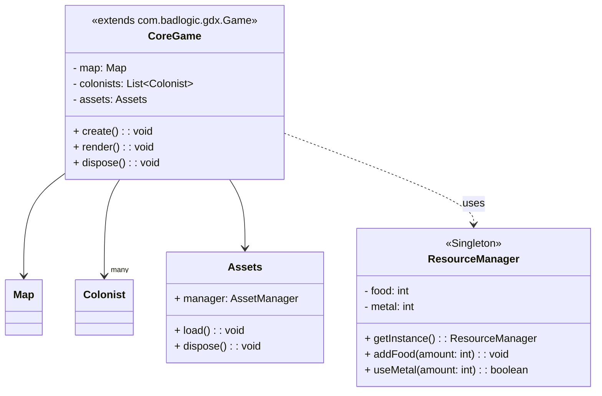

```mermaid
classDiagram
    %% Main Game Class extends LibGDX's Game/ApplicationAdapter
    class CoreGame {
      <<extends com.badlogic.gdx.Game>>
      - map: Map
      - colonists: List~Colonist~
      - assets: Assets
      + create(): void
      + render(): void
      + dispose(): void
    }
    
    class Assets {
      + manager: AssetManager
      + load(): void
      + dispose(): void
    }
    
    %% Resource Management (Singleton)
    class ResourceManager {
      <<Singleton>>
      - food: int
      - metal: int
      + getInstance(): ResourceManager
      + addFood(amount: int): void
      + useMetal(amount: int): boolean
    }
    
    %% Relationships
    CoreGame --> Map
    CoreGame --> "many" Colonist
    CoreGame --> Assets
    CoreGame ..> ResourceManager : uses
```
