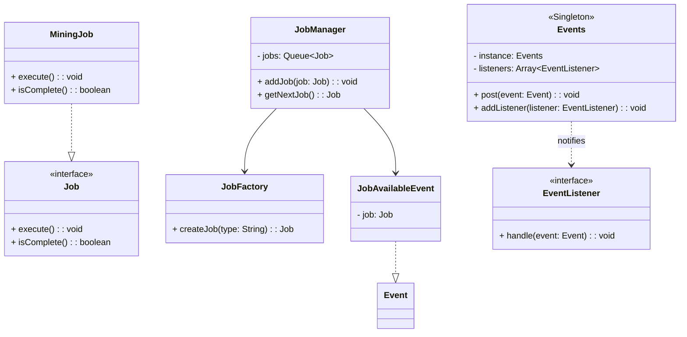

```mermaid
classDiagram
    %% Job Management and Factories
    class JobManager {
      - jobs: Queue~Job~
      + addJob(job: Job): void
      + getNextJob(): Job
    }
    
    class Job {
      <<interface>>
      + execute(): void
      + isComplete(): boolean
    }
    
    class MiningJob {
      + execute(): void
      + isComplete(): boolean
    }
    
    class JobFactory {
      + createJob(type: String): Job
    }
    
    class JobAvailableEvent {
      - job: Job
    }
    
    %% Base Event Class
    class Event {
    }
    
    %% Event System (Singleton)
    class Events {
      <<Singleton>>
      - instance: Events
      - listeners: Array~EventListener~
      + post(event: Event): void
      + addListener(listener: EventListener): void
    }
    
    class EventListener {
      <<interface>>
      + handle(event: Event): void
    }
    
    %% Relationships
    JobManager --> JobAvailableEvent
    JobManager --> JobFactory
    MiningJob ..|> Job
    JobAvailableEvent ..|> Event
    Events ..> EventListener : notifies
```
