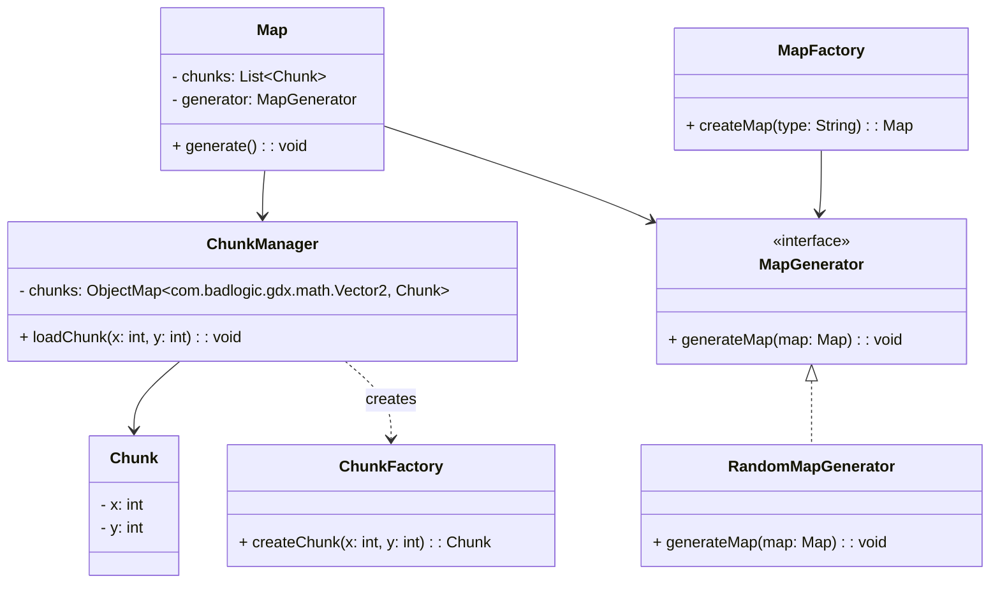

```mermaid
classDiagram
    %% Map and Chunk Management
    class Map {
      - chunks: List~Chunk~
      - generator: MapGenerator
      + generate(): void
    }
    
    class Chunk {
      - x: int
      - y: int
    }
    
    class ChunkManager {
      - chunks: ObjectMap~com.badlogic.gdx.math.Vector2, Chunk~
      + loadChunk(x: int, y: int): void
    }
    
    class ChunkFactory {
      + createChunk(x: int, y: int): Chunk
    }
    
    %% Map Generation
    class MapGenerator {
      <<interface>>
      + generateMap(map: Map): void
    }
    
    class RandomMapGenerator {
      + generateMap(map: Map): void
    }
    
    class MapFactory {
      + createMap(type: String): Map
    }
    
    %% Relationships
    Map --> ChunkManager
    ChunkManager --> Chunk
    ChunkManager ..> ChunkFactory : creates
    Map --> MapGenerator
    MapGenerator <|.. RandomMapGenerator
    MapFactory --> MapGenerator

```
