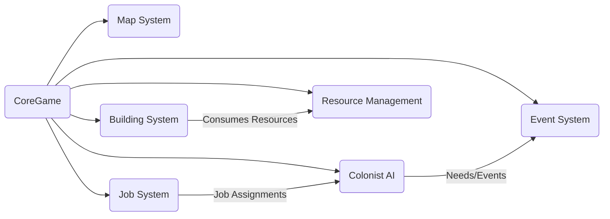

```mermaid
  graph LR
      CG(CoreGame)
      MS(Map System)
      CA(Colonist AI)
      JS(Job System)
      BS(Building System)
      ES(Event System)
      RM(Resource Management)
  
      CG --> MS
      CG --> CA
      CG --> JS
      CG --> BS
      CG --> ES
      CG --> RM
  
      CA -- Needs/Events --> ES
      JS -- Job Assignments --> CA
      BS -- Consumes Resources --> RM
```
